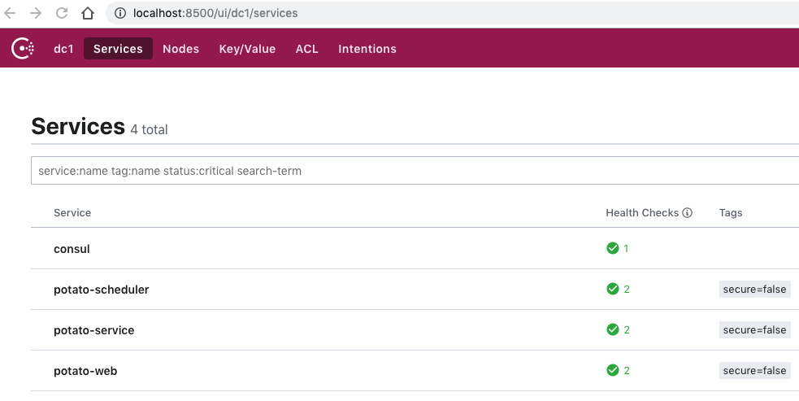
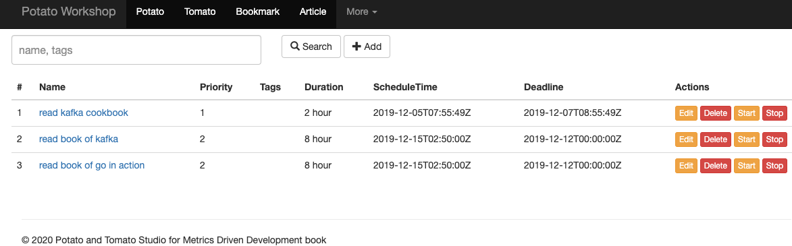
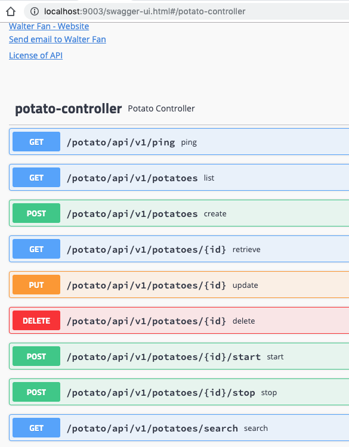

# MDD (Metrics Driven Development)

Samples for Metrics Driven Development Book


## modules

1. Account

	Account Service based on Flask in Python

2. Alertor

	Alertor to check metrics and trigger alert based on ElasticSearch API.

3. Potato

	Potato service based on Spring boot

   * Consul snapshot:
   
	

   * Web Page:
   
	

   * Web API:
   
	

4. Scripts

  * Data Analysis scripts
  * Performance testing scripts
  
5. docker

	Commonly used docker files

6. oss

	The installation and setup guideline of ELKK, TIG, etc.

7. devops

	The devops scripts


# Environments

Take Ubuntu 16 as example


```
apt install docker
apt install docker-compose

```
## python environment

```
apt install python3
apt install python3-pip

pip3 install virtualenv

virtualenv -p python3 venv
source venv/bin/activate

pip install fabric3
```

## Java environment

```
apt install openjdk-8-jdk
apt install maven
```

# Quick start


## potato service

* test

```
open http://localhost:9005
```


### Dependencies
 * python3
 * fabric3
 * jdk8
 * maven3
 


* deployment

```
cd potato
fab redeploy
```

* check running status

```

docker-compose ps
                Name                                   Command                                  State                                   Ports
-------------------------------------------------------------------------------------------------------------------------------------------------------------
consul                                  docker-entrypoint.sh agent ...          Up                                      8300/tcp, 8301/tcp, 8301/udp,
                                                                                                                        8302/tcp, 8302/udp,
                                                                                                                        0.0.0.0:8400->8400/tcp,
                                                                                                                        0.0.0.0:8500->8500/tcp,
                                                                                                                        0.0.0.0:8600->8600/tcp,
                                                                                                                        0.0.0.0:8600->8600/udp
influxdb                                /entrypoint.sh influxd                  Up                                      0.0.0.0:8083->8083/tcp,
                                                                                                                        0.0.0.0:8086->8086/tcp
local-mysql                             docker-entrypoint.sh --ini ...          Up                                      0.0.0.0:3306->3306/tcp, 33060/tcp
potato-scheduler                        java -jar /opt/potato-sche ...          Up                                      0.0.0.0:9002->9002/tcp
potato-server                           java -jar /opt/potato-app.jar           Up                                      0.0.0.0:9003->9003/tcp
potato-web                              java -jar /opt/potato-web.jar           Up                                      0.0.0.0:9005->9005/tcp
potato-zipkin                           /busybox/sh run.sh                      Up                                      9410/tcp, 0.0.0.0:9411->9411/tcp   
```

