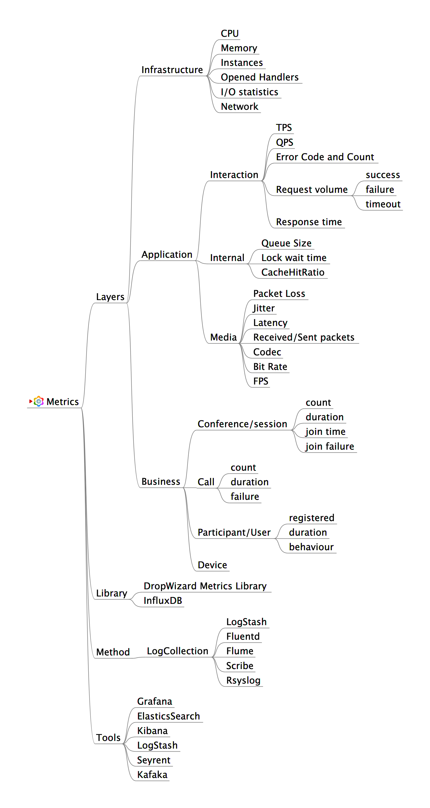

# Ovewview

无法度量，就无法有效地管理，证明和提高

* If you can’t measure it, you can’t manage it
* If you can’t measure it, you can’t prove it
* If you can’t measure it, you can’t improve it

# 究竟要度量度量什么

1. Measure your work
  - Workload, progress, efficiency, etc. 

2. Measure your production
  - Health, usage, trend, KPI, etc. 

3. Measure user’s behavior
  - DAU, JMT, etc.

# 度量的范围

1. Whole development lifetime 全过程
  - Design, coding, testing, deploy, etc. 

2. Whole team 整个团队
  - PM, developer, QA, Operator, etc.

3. Whole levels 全部层次
  - Infrastructure, Platform, Application, Business

# 度量的层次

* 基础设施层 Infrastructure/System metrics
* 中间件层 Middleware metrics
* 应用层 Application metrics
* 业务层 Business metrics

# 度量的内容
* Latency 耗时
* Traffic 流量
* Errors 错误
* Saturation 饱和度，例如 CPU, Memory 及 Disk 的使用及剩余量