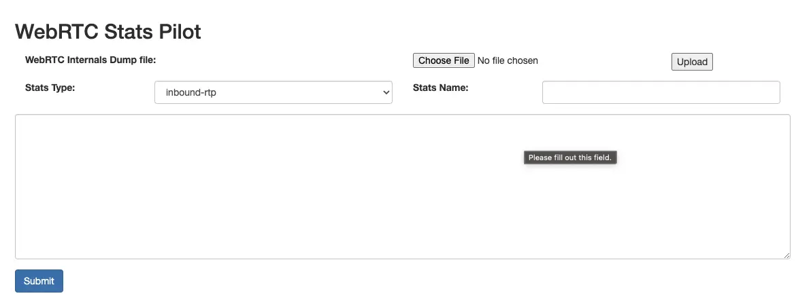

| **Abstract**  | WebRTC stats analyze |
| --------------|------------------------|
| **Authors**   | [Walter Fan](https://www.fanyamin.com)       |
| **Category**  | webrtc note  |
| **Status**    |  v1.0          |
| **Updated**   | 2023-07-01     |
| **License**   |  [CC-BY-NC-ND 4.0](http://creativecommons.org/licenses/by-nc-nd/4.0)|


# Overview

在 WebRTC 的开发过程中, 我们看的最多的度量数据来自 [getStats](https://developer.mozilla.org/en-US/docs/Web/API/RTCPeerConnection/getStats) 接口,  我接触 WebRTC 开发的第一个任务就是定时调用这个接口, 获取, 分析并计算出相应的度量数据, 发送到远程的 ElasticSearch 中做进一步分析.

日常做 QoS 调优时, 看的最多的就是 chrome://webrtc
* chrome://webrtc-internals/ in chrome,
* edge://webrtc-internals/ in edge
* about:webrtc in firefox

主要有如下状态信息以及度量数据:

* ICE connection state
* Signaling state
* ICE candidate grid
* ICE connection candidate pair and related metrics
* Inbound RTP and remote inbound RTP stream metrics
* Outbound RTP and remote outbound RTP stream metrics

下列类别的度量指标

* Candidate-pair
* Local-candidate
* Remote-candidate
* Inbound-rtp
* Outbound-rtp
* Opus codec: maxaveragebitrate, maxplaybackrate, stereo, useinbandfec, etc.
* H264 codec: level-asymmetry-allowed, max-br, max-dpb, max-fps, max-fs, max-mbps, packetization-mode, profile-level-id, id, etc.


以前写过一篇相关的笔记 [WebRTC 之度量与统计: 到底出了什么问题](https://www.jianshu.com/p/419ca6fbdb60)

我用过最多的分析工具是 https://fippo.github.io/webrtc-dump-importer/, 它是一个 Web 前端的分析工具, 用来分析和展示从 chrome://webrtc-internals导出的文件, 功能强大.

可是用的多了, 难免有些地方不太满意, 尤其我常常需要自动分析提取一些度量数据, 这个 web 工具用起来并不趁手, 索性自己用 python 写一个脚本. 用来分析 chrome://webrtc-internals 的导出文件结构其实不复杂, 就是一个大的 JSON 文件, 基本结构大致如下:

```
{
    "PeerConnections": {"9-1": {
        "stats": {
            "T31-[bytesSent_in_bits/s]": {
                "values": "[0,0,672,0,...,0,448]",
                "statsType": "transport",
                "startTime": "2023-04-25T07:13:58.127Z",
                "endTime": "2023-04-25T07:20:19.289Z"
            },
            //...
    }}}}
}

```
完整的例子请参见 https://github.com/walterfan/webrtc_stats/blob/master/samples/receiver_webrtc_internals_dump.txt

最顶层的节点是 PeerConnections, 包含的子节点是 PeerConnection 的标识, 其子节点 stats 中包含所有相关的度量数据,
结构如下, 键 key 是度量所属类型节点的标识加上度量的名称,中间用横线隔开.

例如 "T31-[bytesSent_in_bits/s]", 它是一个 "transport" 类型的度量数据,  T31 是这个 transport 的标识, "[bytesSent_in_bits/s]"是这个度量指标的名称, startTime 和 endTime 是度量采集的开始和结束时间, 具体的度量指标在 value 节点中, 它其实就是一个度量值的列表.

```
"T31-[bytesSent_in_bits/s]": {
    "values": "[0,0,...,0,448]",
    "statsType": "transport",
    "startTime": "2023-04-25T07:13:58.127Z",
    "endTime": "2023-04-25T07:20:19.289Z"
}
```

了解了结构, 代码就好写了, 核心代码如下, 解析出来的数据分门别类放在 Pandas 的 DataFrame 中以供检索和分析

```
def parse(self, file_name):
        with open(file_name, 'r', encoding='utf_8') as f:
            logger.info(f"open {file_name}")
            self._webrtc_internals = {}
            try:
                self._webrtc_internals = json.load(f)
            except:
                logger.errror('not a json file {}'.format(file_name))

            for pcKey, pcValue in self._webrtc_internals['PeerConnections'].items():
                pcStats = pcValue["stats"]

                for itemKey, itemDict in pcValue.items():

                    if itemKey == "stats":

                        for statKey, statDict in itemDict.items():
                            statsItem = {}
                            statsItem["key"] = statKey
                            statsItem["pc"] = pcKey
                            if "-" in statKey:
                                arr = statKey.split("-")
                                statsItem["id"] = arr[0]
                                statsItem["name"] = arr[1]

                            statsItem.update(statDict)
                            self._pc_stats.append(statsItem)

                    elif itemKey == "updateLog":
                        self._pc_events = itemDict
                    else:
                        pass

        self._webrtc_stats = pd.DataFrame.from_records(self._pc_stats)

        self._webrtc_events = pd.DataFrame.from_records(self._pc_events)

        self._media_stats = self.get_metrics_values(self._webrtc_stats)
```

完整的代码参见  https://github.com/walterfan/webrtc_stats/blob/master/src/webrtc_stats/analyzer.py

你可以从 github 下 clone 下来试试, 也欢迎提交 issue 或 commit 

```
virtualenv -p python3 venv
source venv/bin/activate
pip install -r requirements.txt
```

命令行的用法很简单, 我写了一个 fabric file 提供如下的命令行

```
fab -l
Available tasks:

  candidate-pair-stats   usage: fab candidate-pair-stats -f samples/receiver_webrtc_internals_dump.txt
  frontend
  inbound-rtp-stats      usage: fab inbound-rtp-stats -f samples/receiver_webrtc_internals_dump.txt
  local-ip
  media-stats            usage: fab media-stats -f samples/receiver_webrtc_internals_dump.txt -t inbound-rtp -n "[bytesReceived_in_bits/s]"
                                fab media-stats -f samples/receiver_webrtc_internals_dump.txt -n "[framesDecoded/s]"  -i IT01V467742569
  outbound-rtp-stats     usage: fab outbound-rtp-stats -f samples/sender_webrtc_internals_dump.txt
  rtp-stats              usage: fab rtp-stats -f samples/sender_webrtc_internals_dump.txt -c outbound-rtp -b "[bytesSent_in_bits/s]"
```

如果你想查看 inbound-rtp 的度量数据, 命令行示例如下:

```
$ webrtc_stats % fab inbound-rtp-stats -f samples/receiver_webrtc_internals_dump.txt

# inbound-rtp: IT01V467742569

* IT01V467742569-[bytesReceived_in_bits/s]:  [1057815.6084069193, 1949136.4, 2380781.399318759, 1181545.8275777523, 1729870.2551245708, 2928208.0, 2665694.498708824, 2764680.961158322, 3107860.3648904916, 2916136.0]
* IT01V467742569-frameWidth:  [960, 1920, 1920, 1920, 1920, 1920, 1920, 1920, 1920, 1920]
* IT01V467742569-framesPerSecond:  [22, 31, 27, 28, 30, 30, 20, 26, 33, 28]
* IT01V467742569-framesDecoded:  [2954, 4312, 5017, 5035, 5065, 5095, 5115, 5141, 5174, 5202]
* IT01V467742569-[framesDecoded/s]:  [31.181973109198267, 22.633333333333333, 25.546255135422783, 31.914886277745744, 29.970032140065328, 30.0, 19.98002142671022, 26.052100424375453, 32.96703535407186, 28.0]
* IT01V467742569-keyFramesDecoded:  [59, 67, 67, 67, 67, 67, 67, 67, 67, 67]
* IT01V467742569-nackCount:  [3632, 3855, 3998, 3998, 3998, 3998, 4002, 4009, 4015, 4020]
* IT01V467742569-pliCount:  [151, 151, 151, 151, 151, 151, 151, 151, 151, 151]
* IT01V467742569-ssrc:  ['467742569', '467742569', '467742569', '467742569', '467742569', '467742569', '467742569', '467742569', '467742569', '467742569']
* IT01V467742569-kind:  ['video', 'video', 'video', 'video', 'video', 'video', 'video', 'video', 'video', 'video']

# inbound-rtp: IT11A558062930

* IT11A558062930-[bytesReceived_in_bits/s]:  [226840.0292826884, 226648.8, 224852.26749868362, 225191.43757577398, 231104.91183847174, 222264.0, 226573.44297889387, 227254.47600955202, 226573.44297889387, 226800.0]
* IT11A558062930-ssrc:  ['558062930', '558062930', '558062930', '558062930', '558062930', '558062930', '558062930', '558062930', '558062930', '558062930']
* IT11A558062930-kind:  ['audio', 'audio', 'audio', 'audio', 'audio', 'audio', 'audio', 'audio', 'audio', 'audio']

```

* 查看所有输入 RTP 的比特率

```
% fab media-stats -f samples/receiver_webrtc_internals_dump.txt -t inbound-rtp -n "[bytesReceived_in_bits/s]"
                                            key                                             values                 startTime                   endTime
94    IT21V2517750364-[bytesReceived_in_bits/s]  [0,0,0,0,0,0,0,0,0,0,0,0,0,0,0,0,0,0,0,0,0,0,0...  2023-04-25T07:13:58.127Z  2023-04-25T07:20:19.289Z
373    IT11A558062930-[bytesReceived_in_bits/s]  [0,1200,1200,1222.7773113146654,1200,1176,1201...  2023-04-25T07:13:58.127Z  2023-04-25T07:20:19.289Z
504    IT01V467742569-[bytesReceived_in_bits/s]  [0,3378640,3345656,3023744.474684042,2627192,2...  2023-04-25T07:13:58.127Z  2023-04-25T07:20:19.289Z
878   IT31A4243477824-[bytesReceived_in_bits/s]  [0,0,0,0,0,0,0,0,0,0,0,0,0,0,0,0,0,0,0,0,0,0,0...  2023-04-25T07:13:58.127Z  2023-04-25T07:20:19.289Z
1054  IT11A2396938120-[bytesReceived_in_bits/s]  [0,0,0,0,0,0,0,0,0,0,0,0,0,0,0,0,0,0,0,0,0,0,0...  2023-04-25T07:13:58.127Z  2023-04-25T07:20:19.289Z
1110   IT11A123918746-[bytesReceived_in_bits/s]  [0,0,0,0,0,0,0,0,0,0,0,0,0,0,0,0,0,0,0,0,0,0,0...  2023-04-25T07:13:58.127Z  2023-04-25T07:20:19.289Z
```

还可以用如下命令只分析其一项指标的变化

```
% fab media-stats -f samples/receiver_webrtc_internals_dump.txt -n "[framesDecoded/s]"  -i IT01V467742569
+-----+----------------------------------+-----------+
|     | timestamp                        |     value |
|-----+----------------------------------+-----------|
|   0 | 2023-04-24 23:13:58.127000+00:00 |  0        |
|   1 | 2023-04-24 23:13:59.127000+00:00 | 15        |
|   2 | 2023-04-24 23:14:00.127000+00:00 | 18        |
|   3 | 2023-04-24 23:14:01.127000+00:00 | 21.978    |
|   4 | 2023-04-24 23:14:02.127000+00:00 | 24        |
|   5 | 2023-04-24 23:14:03.127000+00:00 |  9        |
|   6 | 2023-04-24 23:14:04.127000+00:00 | 20.02     |
|   7 | 2023-04-24 23:14:05.127000+00:00 | 13.9795   |
|   8 | 2023-04-24 23:14:06.127000+00:00 | 15.0862   |
|   9 | 2023-04-24 23:14:07.127000+00:00 |  8.00801  |
|  10 | 2023-04-24 23:14:08.127000+00:00 |  7.99201  |
```

当然, 对于那些用惯了图形化界面的同学, 我也写了一个图形界面, 代码正在施工中, 敬请期待




<hr/>
本作品采用[知识共享署名-非商业性使用-禁止演绎 4.0 国际许可协议](http://creativecommons.org/licenses/by-nc-nd/4.0/)进行许可。